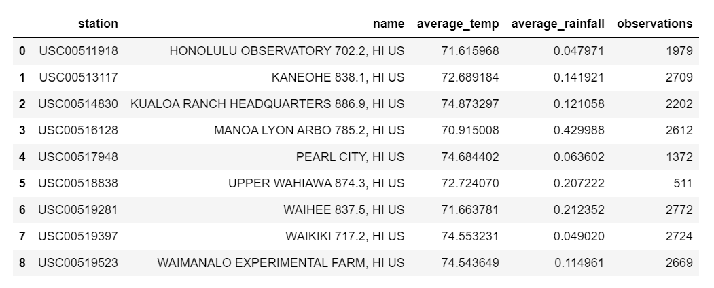
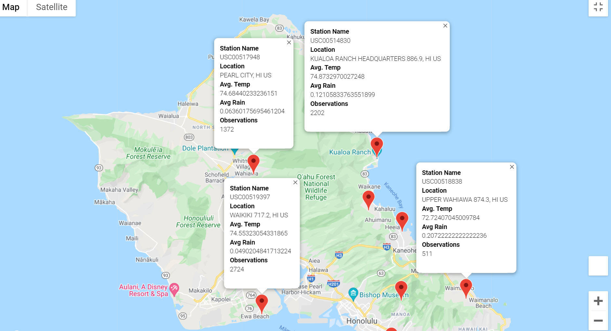
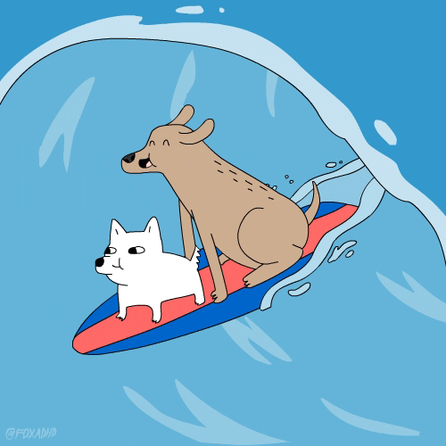

# surfs_up :surfer:
OSU Module 9 - SQLite and Flask


Overview of the analysis: 
- We want temperature data for the months of June and December in Oahu, in order to determine if the surf and ice cream shop business is sustainable year-round.
- Gather temperature trends for Winter and Summer months over a seven-year span.
   - Specifically for the months of December and June from nine different weather stations across the island of Oahu.

Results:
- Gather temperature trends for Winter and Summer months over a seven-year span.


```python

# 1. Import the sqlalchemy extract function.
from sqlalchemy import extract
# 2. Write a query that filters the Measurement table to retrieve the temperatures for the month of June. )
jun_results = session.query(Measurement.date, Measurement.tobs).filter(func.strftime("%m", Measurement.date) == "06")
# 3. Create a DataFrame from the list of temperatures for the month of June. 
jun_df = pd.DataFrame(jun_results, columns=['Date','June Temps'])
jun_df.set_index(jun_df['Date'], inplace=True)
jun_df.describe()

```
| Statistic | June Temps |       
| --- | --- |                    
|count|  1700.000000 |
|mean|  74.944118 |
|std|  3.257417 |
|min|  64.000000 |
|25%|  73.000000 |
|50%|  75.000000 |
|75%|  77.000000 |
|max|  85.000000 |

```python

# 1. Import the sqlalchemy extract function.
from sqlalchemy import extract
# 2. Write a query that filters the Measurement table to retrieve the temperatures for the month of December. )
dec_results = session.query(Measurement.date, Measurement.tobs).filter(func.strftime("%m", Measurement.date) == "12")
# 3. Create a DataFrame from the list of temperatures for the month of December. 
dec_df = pd.DataFrame(dec_results, columns=['Date','December Temps'])
dec_df.set_index(dec_df['Date'], inplace=True)
dec_df.describe()

```

| Statistic | December Temps |       
| --- | --- |                    
|count|  1517.000000 |
|mean|  71.041529 |
|std|  3.745920 |
|min|  56.000000 |
|25%|  69.000000 |
|50%|  71.000000 |
|75%|  74.000000 |
|max|  83.000000 |


Summary:
- Temperatures are slightly lower in December as compared with June, but it should not effect the business.
- A deeper analysis would investigate precipitation in the Winter versus the Summer to see if that could have an impact on the business.


```python

query4 = f'SELECT s.station, s.name, AVG(m.tobs) AS average_temp, AVG(m.prcp) AS average_rainfall, COUNT(s.id) AS observations FROM measurement m JOIN station s ON m.station = s.station GROUP BY s.station'

new_station_summary = pd.read_sql(query4, engine)
new_station_summary

```




```python

# Get lat and long for each station
google_station_summary_df = station_summary_df[['station', 'name','latitude','longitude']]

# Set parameters for the info_box.
info_box_template = """
<dl>
<dt>Station Name</dt><dd>{station}</dd>
<dt>Location</dt><dd>{name}</dd>
<dt>Avg. Temp</dt><dd>{average_temp}</dd>
<dt>Avg Rain</dt><dd>{average_rainfall}</dd>
<dt>Observations</dt><dd>{observations}</dd>
</dl>
"""

# Iterate through the df to populate info box.
weather_station_info = [info_box_template.format(**row) for index, row in new_station_summary.iterrows()]

# Retrieve lat, long to pass to gmaps.
locations = google_station_summary_df[['latitude', 'longitude']]

# 11a. Add a marker layer for each city to the map. 
fig = gmaps.figure()
marker_layer = gmaps.marker_layer(locations, info_box_content=weather_station_info)
fig.add_layer(marker_layer)
# 11b. Display the figure
fig

```




Depending on which side of Oahu you are opening your shop may determine how successful you are.  More rain will fall on the eastern side of the island.
A deeper dive into the microclimates of Oahu and the other Hawaiin islands would really boost investor confidence.

Until then, keep dreaming of riding the wave to a successful adventure.

<!--  -->


Special Thanks to [@hmlanden's](https://github.com/hmlanden) [repository](https://github.com/hmlanden/SurfyAPY) for syntax and formatting help.
